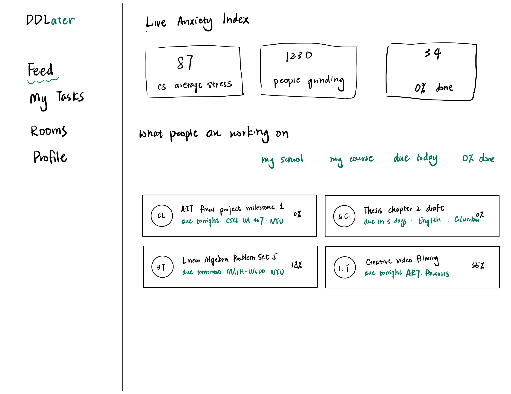
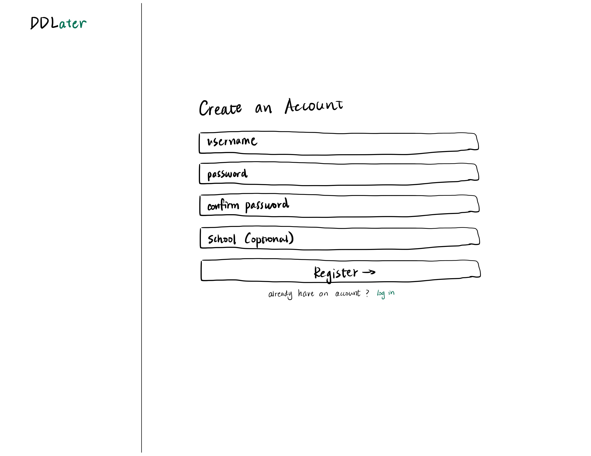
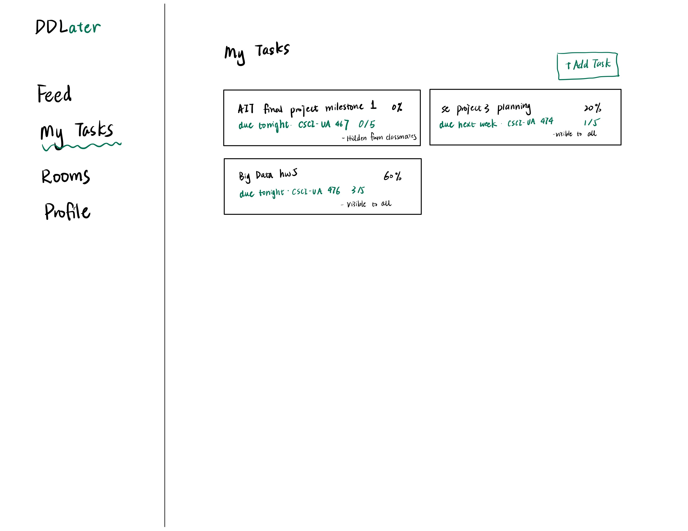
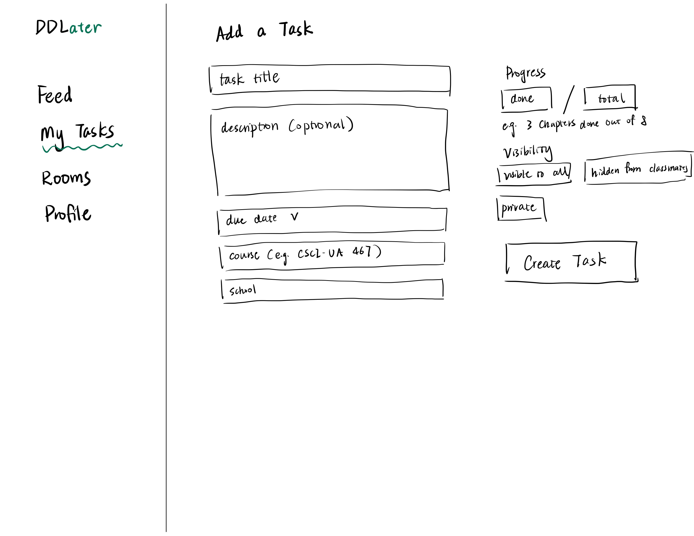
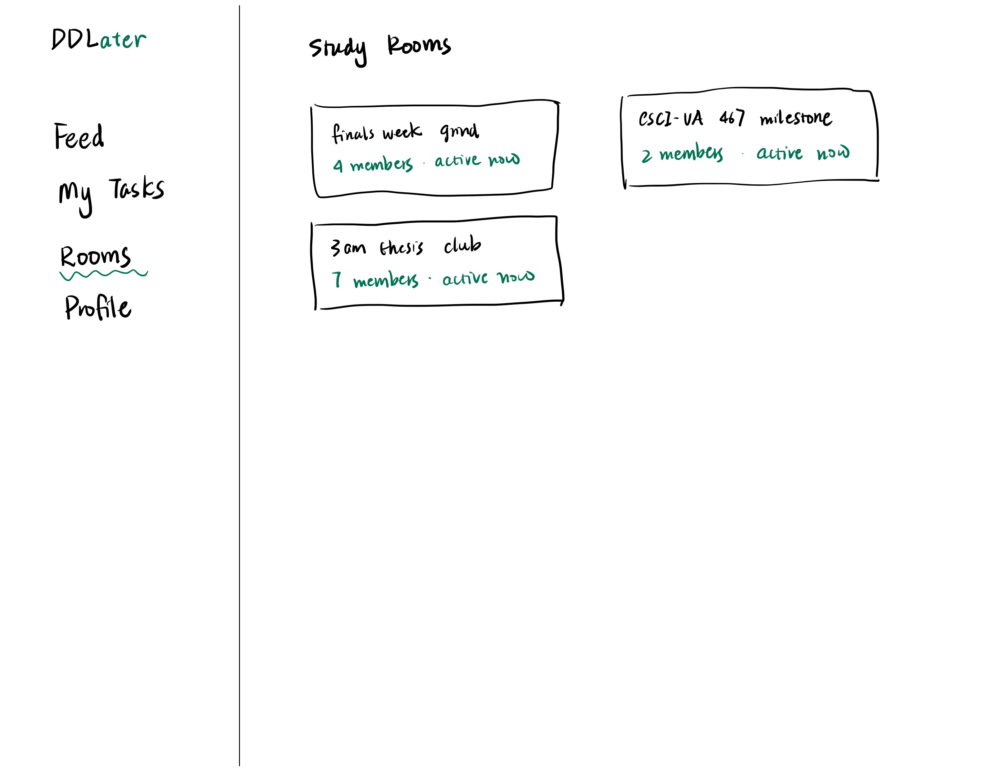
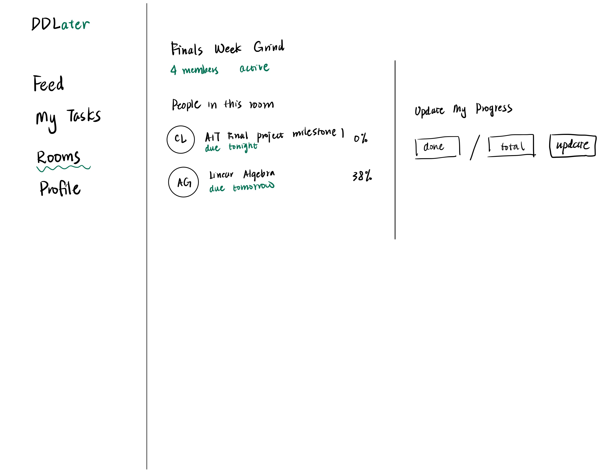
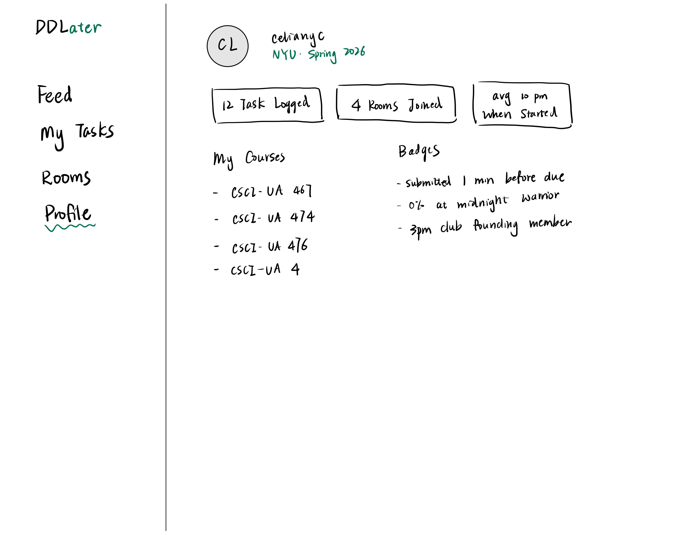
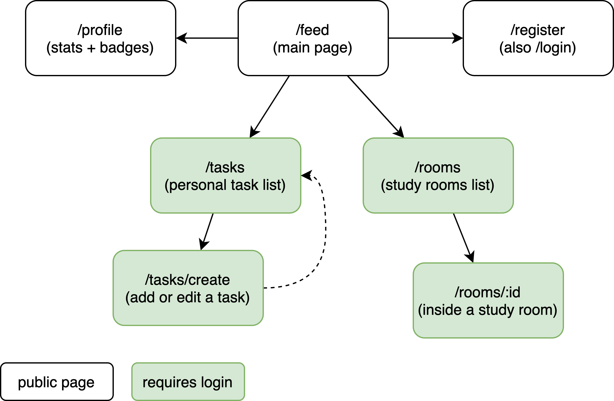

# DDLater

## Overview

Ever find yourself staring at your screen with a deadline tomorrow, nothing done yet unable to start? DDLater is a web app built around the concept of body doubling — the simple but powerful effect of having someone else present when you work.

Instead of suffering through your last-minute crunch alone, DDLater shows you what other students are working on, when their things are due, and how far along they are. Users can log their tasks and progress, join virtual study rooms with others who are currently working, and check a live procrastination index across different majors.


## Data Model

The application will store Users, Courses, Tasks, and Study Rooms.
* a user can enroll in multiple courses (via references)
* a task belongs to one user and optionally one course (via references)
* a study room can have multiple members (via references to users)
* courses are shared across users, multiple users can reference the same course


An Example User:

```javascript
{
  username: "celianyc",
  hash: // a password hash,
  courses: // an array of references to Course documents,
  badges: ["submitted with 4 min to spare", "0% at midnight warrior"]
}
```

An Example Course:

```javascript
{
  courseCode: "CSCI-UA 474",
  courseName: "Software Engineering",
  school: "NYU",
  semester: "Spring",
  year: 2026
}
```

An Example Task:
```javascript
{
  user: // a reference to a User document,
  course: // a reference to a Course document,
  title: "review lecture slides",
  description: "chapters 1-8, focus on week 10 onwards",
  dueDate: // a timestamp,
  progressNumerator: 3,
  progressDenominator: 8,
  hideFromClassmates: false
}
```

An Example Study Room:
```javascript
{
  name: "finals week grind",
  members: // an array of references to User documents,
  createdAt: // a timestamp,
  active: true
}
```

## [Link to Commented First Draft Schema](db.mjs) 

## Wireframes

/feed - main feed showing everyone's tasks and live anxiety index



/register - register and login page



/tasks - personal task list with progress and privacy settings



/tasks/create - form to create or edit a task



/rooms - list of active study rooms



/rooms/:id - inside a study room, see members' progress and update your own



/profile - user profile with stats, badges, and enrolled courses



## Site map



## User Stories or Use Cases

1. as a non-registered user, I can create a new account
2. as a user, I can log in to the site
3. as a user, I can create a new task with a title, due date, course, and progress
4. as a user, I can view all of my tasks in one place to track my own progress
5. as a user, I can update the progress on a task
6. as a user, I can set a task's visibility to hidden from classmates
7. as a user, I can browse the main feed and see what other students are working on and how far along they are
8. as a user, I can create or join a study room to work alongside others in real time
9. as a user, I can view my profile to see my stats and badges

## Research Topics

* (5 points) User authentication with Passport.js
  * using passport.js to handle user registration and login with hashed passwords
  * will implement session-based authentication for protected routes
* (4 points) Real-time study rooms with Socket.io
  * using socket.io to enable real-time progress updates inside study rooms
  * users will see live changes without refreshing the page
* (3 points) React as a front-end framework
  * using React to build the client-side UI with component-based architecture
* (3 points) Phaser.js mini-game in study rooms
  * using Phaser.js to build a small interactive game inside study rooms
* (2 points) D3.js data visualization
  * using D3.js to render the live anxiety index and progress charts on the main feed
* (1 point) Google Calendar API
  * allowing users to import deadlines from their Google Calendar

18 points total out of 10 required points


## [Link to Initial Main Project File](app.mjs) 

## Annotations / References Used

1. [SitePoint - Local Authentication Using Passport in Node.js](https://www.sitepoint.com/local-authentication-using-passport-node-js/) - will be referenced for passport.js setup
2. [Socket.IO - Get Started](https://socket.io/get-started/chat) - will be referenced for real-time study room implementation

(No code references used at this stage. Above might be referenced later)