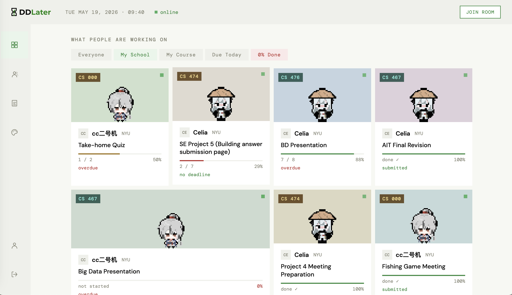
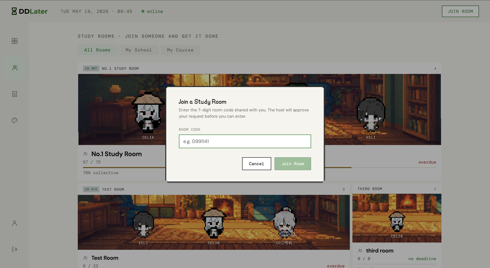
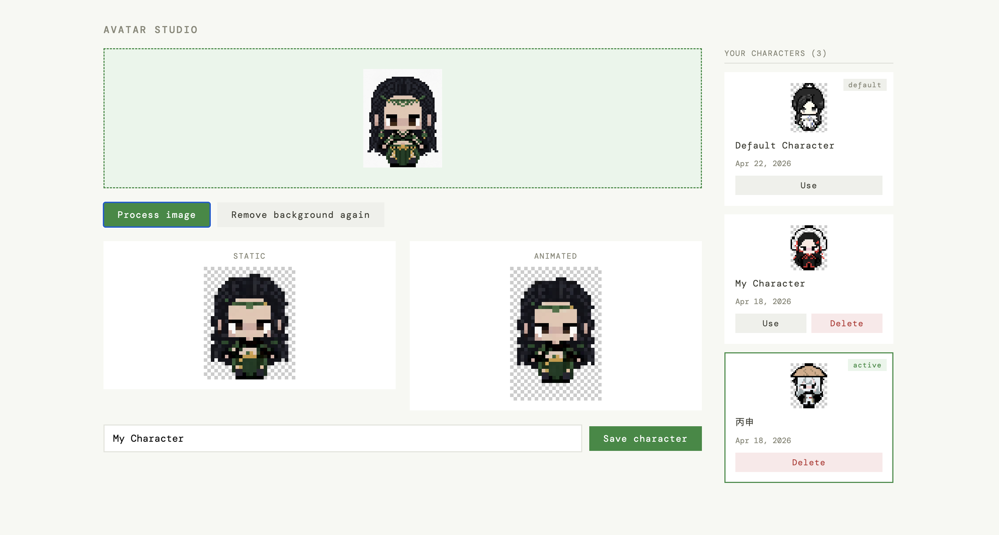
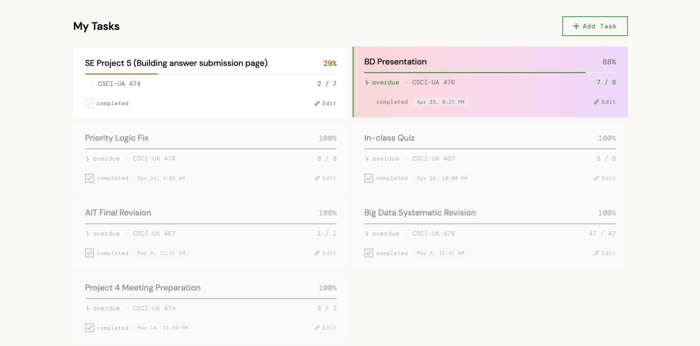

# DDLater

 

## Overview

Ever find yourself staring at your screen with a deadline tomorrow, nothing done yet, unable to start? DDLater is a web app built around the concept of body doubling, the simple but powerful effect of having someone else present when you work.

Instead of suffering through your last-minute crunch alone, DDLater shows you what other students are working on, when their things are due, and how far along they are. You can log your tasks and progress, join virtual study rooms with others who are currently working, and check a live procrastination index across different majors.

## Features

### Real-time study rooms

Join a room and you appear in the scene as a pixel character, alongside everyone else who is currently working. Presence, member join/leave, and seat allocation all update live over Socket.io. Seeing other people show up and grind makes it easier to start.

### Create and join rooms

Spin up a new room for finals week, or hop into an existing one. Rooms are accessible from anywhere in the app.

### Custom pixel avatars

Each user gets their own pixel character. Avatars are built through a custom pipeline: a color-sampled grid with background removal and animated with a discrete, step-based idle motion in the study room.

### Task and progress tracking

Log your tasks with a title, course, due date, and progress. Track everything in one place, and update progress as you go.

### Privacy controls

Not everything needs an audience. Any task can be hidden from classmates while still counting toward your own tracking.

## Tech stack

DDLater is a full-stack app with a separated frontend and backend, both deployed on Render.

- **Frontend:** React 19, React Router, Vite, Context API
- **Backend:** Node.js, Express (ESM)
- **Database:** MongoDB with Mongoose
- **Real-time:** Socket.io, with the live study rooms sharing authentication with the HTTP session layer
- **Auth:** session-based authentication (express-session + bcryptjs + connect-mongo)
- **Pixel characters:** a custom Canvas-based pipeline: color sampling, flood-fill background removal, and discrete step-based idle animation
